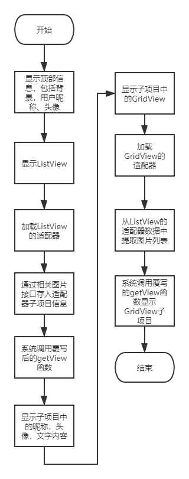

# imgspace

信球网支持本项目：

[信球网](http://xinball.top)  
[信球网](http://xinball.top/img/banner.png)
一个测试markdown文档: [another.md](another.md) 
<hr/>

## 一、小组成员及其分工

### 1. 成员信息：

| 姓名  | 学号 |
| :-----: | :----: |
| 周青  | xxxxxx24 |
| 侯玉峰  | xxxxxx23 |
| 耿堂睿  | xxxxxx14 |
| 林宇旋  | xxxxxx22 |
| 周洲  | xxxxxx26 |
| 张玲玲  | xxxxxx07 |


### 2. 任务分工：

<b>周青</b>：服务端软件搭建与程序编写；服务端和手机端的 json 信息的交互；文件上传、下载；多线程操作；缩略图缓存；项目的融合。

<b>侯玉峰</b>：本地图片：进行图片大图的显示，并能使用手势：左右滑动切换图片、双指操作缩放和旋转、双击放大和缩小、点击指定按钮实现图片的缩放和旋转。通过点击“编辑”按钮实现对图片进行旋转和缩放的编辑操作，编辑后的图片另外保存在该图片同目录下。 图片空间：大图的查看与本地类似，但不支持编辑操作，只有删除图片的按钮。耿堂睿：本地图片：调用系统的文件管理器进行查找系统的文件，选择被用户点击的文件夹，显示本文件夹内图片列表和缩略图。 图片空间：类似于朋友圈的界面，对用户名、消息和图片列表的显示以及对消息和图片查看详情、编辑消息和上传图片按钮的显示。 进阶操作：需要对图片缩略图进行缓存

<b>林宇旋</b>和<b>周洲</b>：写注册、登录、发送消息、编辑消息、用户详情界面，以及用户对这些界面的交互操作。掌握好对界面进行交互式操作和页面之间的切换效果。

<b>张玲玲</b>：本地数据库结构的构建，图片数据库的操作；界面美化；对软件进行较为严格的调试，保证软件稳定性。

<hr/>

## 二、项目需求

### 1. 软件名称：图片空间

### 2. 主要功能：图片管理软件，能管理和分享本机的图片
- 多种方式（列表、缩略图）形式显示图片。
- 展示大图，支持缩放，并支持简单的编辑（旋转，缩放等）。
- 支持上传图片到服务器。
- 使用本地 SQLite 数据库存储图片的额外信息，并支持增、删、改、查。
- 使用缩略图缓存，加速列表中图片显示。
- 类似于朋友圈的分享图片的功能。
### 3. 开发环境和工具：
- IDE：Android Studio 4.1.1，IntelliJ IDEA 2020.3
- JAVA：jdk-1.8.0_241_windows-x64
- 数据库：MySQL8.0，SQLite 3.34.0


<hr/>

## 三、项目要点

#### 1.	线程
本程序中使用多线程进行网络访问和大量的数据传输的操作，以防止程序出现卡顿，无响应的情况。主要采用重载继承于AsyncTask类的构造函数传进所需对象，重载doInBackgroung函数进行网络访问与大数据传输，重载onPostExcute函数进行多线程过程完成后的操作。

#### 2.	文件
在对本地图片文件进行管理时，主要采用由用户选择某图片，程序将该路径下所有的图片展示出来，并对图片进行编辑、保存操作。

#### 3.	网络
访问网络均采用在特定网址以Post方式发送Json字符串，进而由服务器对发送的数据进行解析和操作各项事务。对文件进行上传下载操作：上传主要以Post方式附加发送各个文件的数据块，由服务端指定页面接收并将发送的文件按照Json字符串解析的方式传输至服务器指定位置。下载主要采用访问服务端提供的url进行文件传输，并下载至指定缓存目录。

#### 4.	数据库
服务器采用MySql数据库，进行管理各个用户，发送的消息和图片的信息。本地采用SqLite数据库，对图片信息进行管理。

#### 5.	界面
界面主体参考自各大主流APP界面的布局，并由每个成员齐心协力修复、美化完成。
主页面采用navigation管理三个fragment页面，并实现三个界面的显示。
登录、注册等xml布局主要采用RelativeLayout和LinerLayout相结合的方式，部分界面使用了scrollView。发送界面采用了gridView来实现图片的添加。
对话框采用自定义xml文件并设置View进行个性化定制对话框。


<hr/>

## 四、设计思想

### 1.整体设计分析：

设计比较符合用户操作流程。

### 2.流程图：

- 网络访问：创建HTTPS连接->设置HTTPS属性->写入JSON数据和文件数据->进行连接->获取服务端响应->判断响应信息->交付给程序进行管理


<del>可能由于github原因无法显示图片</del>

~~可能由于github原因无法显示图片~~

<i>本地图片预览：</i>



<i>图片空间：</i>


<i>图片查看编辑：</i>


- 注册：
1.	判断各个编辑框内容不为空
2.	判断密码与确认密码是否相同，判度密码个数是否大于6为
3. 用户名不能全为数字，手机号全为数字

- 登录：
1.	判断各编辑框内容不为空
2.	判断用户是使用手机号，还是用户名

- 发送：
1.	获得读写存储空间权限，获得图片地址并上传
2.	单击图片，出现删除提示框，可以删除图片或取消

- 用户：
1.	单击头像可从本地图片中选择图片
2.	实现了裁剪功能，可裁剪图片大小
3.	对于用户自己的界面和其它用户的界面做出区分


### 3.功能模块
本地图片预览：调用系统文件管理器，获取路径，缩略图/列表显示，缩略图/列表切换，点击图片跳转图片查看器。
图片空间：类似微信朋友圈的布局显示，点击图片跳转图片查看器，点击文字跳转编辑页面。
图片查看编辑：主要有两个功能，一个是点击图片的缩略图后显示完整的图片，并且该图片可以随手势切换到其相邻的图片，还可以随手势缩放；另一个是图片的具体编辑，在前面功能的界面里点击编辑按钮，会进入图片的编辑界面，有旋转和剪切两个小功能，点击相应的按钮会进入相应的功能模块。

### 4.程序界面设计布局：
- 本地图片：总预览包括缩略图显示和列表显示，其中缩略图显示采用了GridView，列表采用了ListView，比较相似的是，两者均通过setAdapter加载一个SimpleAdapter类来实现子项目的显示，而缩略图子项目使用LinearLayout垂直布局的方式依次显示图片和文字，并且通过将ImageView锁定纵横比的功能关闭，从而更好地设计外观；列表子项目则采用LinearLayout水平布局。都是通过提前获取本机文件夹的路径，进而获取文件夹中的图片。

- 图片空间：采用了ListView嵌套GridView的方式实现，首先通过RelativeLayout布局设计顶部大图以及用户名字和头像的显示，然后通过ListView的setAdapter函数加载一个自己编写的继承自BaseAdapter的适配器MyListAdapter，然后重载getView完成子项目中人物头像，名字，文字内容的显示，以及提供点击内容响应的接口函数，并在getView中给嵌套的GridView加载另一个继承自BaseAdapter的适配器MyGridAdapter，依旧通过重载getView显示出要显示的图片，并提供出点击图片的接口函数。

- 图片查看编辑：首先实现图片随手势切换的布局activity_real_picture.xml，在该布局中我使用了ViewPager外部库来实现的，而图片随手势的缩放我是通过外部库PinchImageView来实现的。在该布局中还有六个按钮，分别实现：后退，保存，分享，删除，编辑，菜单。点击编辑按钮后进入下一个布局edit_layout.xml，该布局就是在屏幕中央显示一张待编辑图片，图片下方有旋转和剪切按钮，点击后分别进入activity_cut.xml和activity_rotate.xml，在这两个布局中都是在屏幕中央显示图片，activity_cut.xml布局会在在图片中间显示一个裁剪框，该布局主要通过外部库ImageCropper来实现，而activity_rotate.xml布局在图片下方会有一个刻度尺来进行图片的旋转，该刻度尺是通过外部库RuleView来实现

### 5.图片展示
首先运用bitmap类进行图片解析，但当其压缩率太大时，图片响应很慢，后来运用Glide第三方类进行显示，发现本地加载速度明显优于服务器，因此将图片由服务器下载下载后，再由Glide进行压缩显示本地缓存图片。

### 6.数据库具体处理过程
向服务器发送JSON数据->服务器解析数据->将数据按照指定方法进行处理->调用数据库操作dao类->数据库执行动态SQL语句->返回SQL结果->服务器处理SQL结果->将服务器返回值作为HTML页面按照指定格式显示。
一共三个表：user用户表，message消息表，photo图片表

```MySql
-- ----------------------------
-- Table structure for message
-- ----------------------------
DROP TABLE IF EXISTS `message`;
CREATE TABLE `message`  (
  `mid` char(13) CHARACTER SET utf8mb4 COLLATE utf8mb4_0900_ai_ci NOT NULL COMMENT '消息编号',
  `uid` char(6) CHARACTER SET utf8mb4 COLLATE utf8mb4_0900_ai_ci NOT NULL COMMENT '用户编号',
  `content` varchar(255) CHARACTER SET utf8mb4 COLLATE utf8mb4_0900_ai_ci NULL DEFAULT NULL COMMENT '消息内容',
  `sendtime` datetime NOT NULL COMMENT '发送时间',
  `altertime` datetime NULL DEFAULT NULL,
  `display` int NOT NULL COMMENT '显示',
  PRIMARY KEY (`mid`, `uid`) USING BTREE
) ENGINE = InnoDB CHARACTER SET = utf8mb4 COLLATE = utf8mb4_0900_ai_ci ROW_FORMAT = Dynamic;
-- ----------------------------
-- Table structure for photo
-- ----------------------------
DROP TABLE IF EXISTS `photo`;
CREATE TABLE `photo`  (
  `pid` char(2) CHARACTER SET utf8mb4 COLLATE utf8mb4_0900_ai_ci NOT NULL COMMENT '图片编号',
  `uid` char(6) CHARACTER SET utf8mb4 COLLATE utf8mb4_0900_ai_ci NOT NULL COMMENT '用户编号',
  `mid` char(13) CHARACTER SET utf8mb4 COLLATE utf8mb4_0900_ai_ci NOT NULL COMMENT '消息编号',
  `url` varchar(255) CHARACTER SET utf8mb4 COLLATE utf8mb4_0900_ai_ci NOT NULL COMMENT '文件：uid+mid+pid+后缀格式',
  `uploadtime` datetime NOT NULL COMMENT '上传时间',
  `display` int NOT NULL COMMENT '修改时间',
  PRIMARY KEY (`pid`, `uid`, `mid`) USING BTREE
) ENGINE = InnoDB CHARACTER SET = utf8mb4 COLLATE = utf8mb4_0900_ai_ci ROW_FORMAT = Dynamic;
-- ----------------------------
-- Table structure for user
-- ----------------------------
DROP TABLE IF EXISTS `user`;
CREATE TABLE `user`  (
  `uid` char(6) CHARACTER SET utf8mb4 COLLATE utf8mb4_0900_ai_ci NOT NULL COMMENT '用户编号',
  `name` varchar(255) CHARACTER SET utf8mb4 COLLATE utf8mb4_0900_ai_ci NOT NULL COMMENT '用户名',
  `pwd` varchar(255) CHARACTER SET utf8mb4 COLLATE utf8mb4_0900_ai_ci NOT NULL COMMENT '密码',
  `email` varchar(255) CHARACTER SET utf8mb4 COLLATE utf8mb4_0900_ai_ci NOT NULL COMMENT '电子邮箱',
  `tel` varchar(255) CHARACTER SET utf8mb4 COLLATE utf8mb4_0900_ai_ci NOT NULL COMMENT '手机号码',
  `nickname` varchar(255) CHARACTER SET utf8mb4 COLLATE utf8mb4_0900_ai_ci NULL DEFAULT NULL COMMENT '用户昵称',
  `realname` varchar(255) CHARACTER SET utf8mb4 COLLATE utf8mb4_0900_ai_ci NULL DEFAULT NULL COMMENT '真名',
  `slogan` varchar(255) CHARACTER SET utf8mb4 COLLATE utf8mb4_0900_ai_ci NULL DEFAULT NULL COMMENT '个签',
  `sex` int NULL DEFAULT NULL COMMENT '性别',
  `birthday` datetime NULL DEFAULT NULL COMMENT '生日',
  `livead` varchar(255) CHARACTER SET utf8mb4 COLLATE utf8mb4_0900_ai_ci NULL DEFAULT NULL COMMENT '住址',
  `regtime` datetime NOT NULL COMMENT '注册时间',
  `regip` varchar(255) CHARACTER SET utf8mb4 COLLATE utf8mb4_0900_ai_ci NOT NULL COMMENT '注册ip',
  `active` int NULL DEFAULT NULL COMMENT '是否激活',
  PRIMARY KEY (`uid`) USING BTREE
) ENGINE = InnoDB CHARACTER SET = utf8mb4 COLLATE = utf8mb4_0900_ai_ci ROW_FORMAT = Dynamic;

```

其中，user中的uid为其联合主键，message中的mid和uid为其联合主键，photo中的pid,uid,mid为其联合主键。

### 7.文件的具体操作方式
主要采用文件输入和输出流，对文件进行读入写出；图片类还需要加入对图片的压缩，编辑后的图片由bitmap类输出至本地文件夹。网络图片下载至指定缓存目录，在进行网络图片读操作时，先查找本地图片。


<hr/>

## 五、代码示例及分析

### 1.广播的发送与接收：
在图片空间中加入广播起到了接收由本地按钮点击后发送Intent的action；广播内处理获取关键词，并调用多线程进行界面的刷新。

```Java
 	//SpaceActivity.java
 	///接收由本地按钮点击后发送Intent的action
    intentFilter=new IntentFilter();
    intentFilter.addAction("SpaceRefresh");
    registerReceiver(SpaceReceiver,intentFilter);
	
	///广播内处理获取关键词，并调用多线程进行界面的刷新
    private final BroadcastReceiver SpaceReceiver = new BroadcastReceiver(){
        @Override
        public void onReceive(Context context, Intent intent) {
            String action=intent.getAction();
            if(action.equals("SpaceRefresh")){
                String key=intent.getStringExtra("key");
                if(key!=null&&key.equals(""))
                    key=null;
                if(priuser==null){
                    uid=intent.getStringExtra("uid");
                    if(uid!=null&&uid.equals(""))
                        uid=null;
                }else{
                    uid=priuser.uid;
                }
                //Toast.makeText(mainActivity,"send ok!", Toast.LENGTH_SHORT).show();
                spaceTask = new SpaceTask(key);
                DisplayUtil.showProgress(context,spaceProgressView,spaceView,true);
                spaceTask.execute();
            }
        }
    };
```


### 2.网络访问策略：

```Java
	//HttpsUtil.java
	URL url = new URL(urlStr);
	HTTPSTrustManager.allowAllSSL();//信任所有证书
	HttpsURLConnection con = (HttpsURLConnection)  url.openConnection();
    /* 允许Input、Output，不使用Cache */
    con.setSSLSocketFactory(getSSLContext(context).getSocketFactory());
    con.setDoInput(true);
    con.setDoOutput(true);
    con.setUseCaches(false);
    /* 设定传送的method=POST */
    con.setRequestMethod("POST");
    /* setRequestProperty */
    con.setConnectTimeout(10*1000);//超时时间
    con.setReadTimeout(10*1000);
    con.setRequestProperty("Accept-Charset", "UTF-8");
    con.setRequestProperty("Connection", "Keep-Alive");
    con.setRequestProperty("Charset", charset);
    JSONObject jsob=new JSONObject();

```

### 3.对图片大图操作：
分为本地和网络两种，各有不同显示效果；相应的，对于自己图片和他人图片会减少删除按钮的显示。

```Java
	//RealPicture.java
    public void menu(View view){
        if(local){
            String path=(String) myPagerAdapter.getPrimaryItem();
            DisplayUtil.dialogProcess(this,"图片位置为："+ path,true,"图片信息","好！",null);
        }else{
            Photo photo=(Photo) myPagerAdapter.getPrimaryItem();
            DisplayUtil.dialogProcess(this,"网络路径为："+ APIAddress.WEB_IMG_URL+photo.url+
                    "\n本地保存位置为："+ Environment.getExternalStorageDirectory()+APIAddress.WebcachePath+photo.uid+"\n上传时间为："+DisplayUtil.dateFormat.format(photo.uploadTime),
                    true,"图片信息","好！",null);
        }
        //Toast.makeText(RealPicture.this,"你点击了菜单按钮",Toast.LENGTH_SHORT).show();
    }
    
```


<hr/>

## 六、测试

### 本地，个人空间，朋友圈：

### 图片查看和编辑：


<hr/>


## 七、评价及总结

> 周青：在本次安卓程序设计中，主要遇到的问题就是每一个成员所写的程序在一定程度上不能够融合，这说明了接口没有定义完善，在今后的学习生活中，需要将程序各个框架严格定义，以保证标准统一。其次，遇到了安卓不同版本在网络，内存等问题不能完全兼容的情况，在查阅安卓开发相关的标准后，发现安卓7.0以上必须通过https协议明文访问，因此，修改了服务器的协议，并将网站证书添加进入项目的assets中，完成了程序对网络的访问。

> 耿堂睿：该实验项目界面简洁，设计精良，功能强大多样，是一个很不错的设计。通过实验使我受益匪浅，我不仅仅学习到了专业知识，更重要的是收获了经验与体会，这些使我一生受用不尽，记下来与大家共勉。一开始的时候完全是老师讲什么就做什么，感觉速度还是比较快的，跟理论也没什么差距。但是之后就逐渐产生了问题。从一次次不断地修复bug中，给我的感觉都是理论没有很好的跟上实践，以至于理解不了bug的原理，从而盲目地改代码，导致错上加错。因此在编写程序时，必须要先弄清楚程序的每一个原理，再写代码，这样才能又快又好。

> 侯玉峰：这次实验让我更加了解团队合作的重要性和高效性，每个人分工各做一部分既可以减少负担，还可以提高效率，很不错。而且这次实验多亏了github和csdn的帮助，没有它们我将寸步难行。

> 周洲&林宇旋：做好工作需要掌握牢靠的基础知识，否则事倍功半。

> 张玲玲：学习到很多安卓相关的知识，增加了界面美化的小策略，熟悉了本地SQLite操作。

<hr/>
